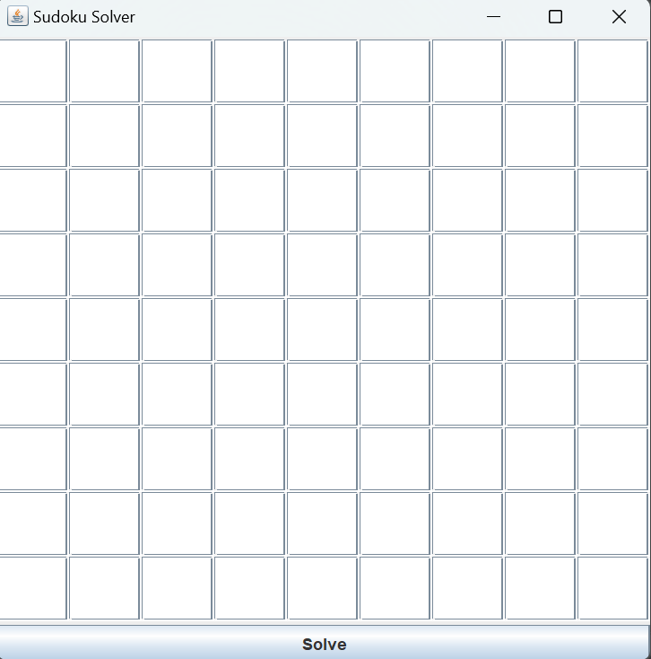
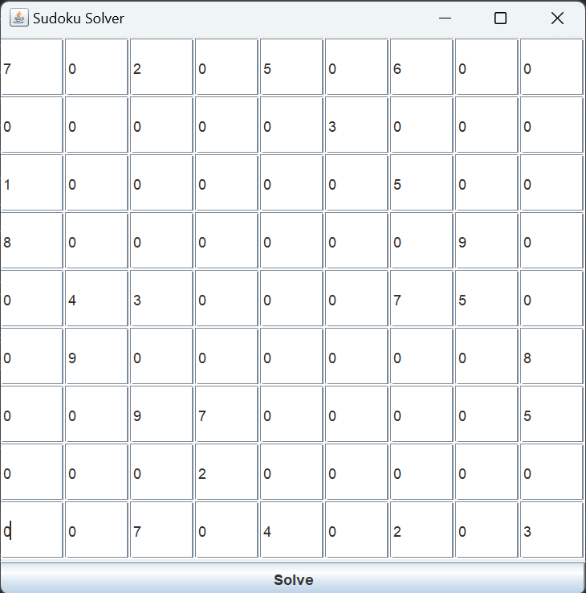
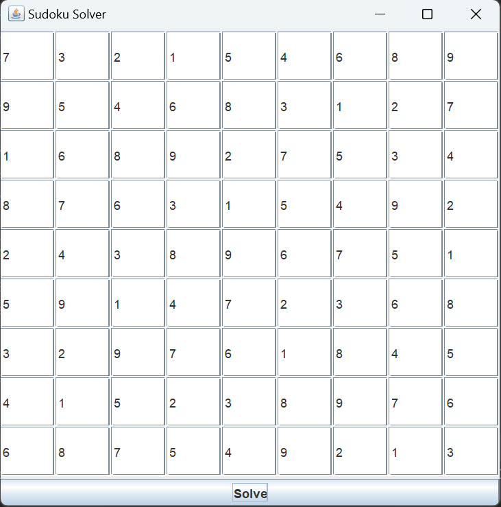

# Introduction
This is a program written entirely in JAVA which deals with Sudoku Puzzles. This program solves Soduku puzzle of any kind.
# Contents
* [Sudoku Solver](#sudoku-solver)
    * [Getting Started (Usage)](#getting-started)
    * [Algorithm Behind Puzzle](#algorithm-behind-puzzle)
    * [Add-Ons](#add-ons)
* [Tools](#tools)
# Sudoku Solver
This is a program which solves 9x9 Sudoku puzzles. Written completely in JAVA and built wholly from scratch, this program reads input  from a user  and solves the puzzle. It employs concepts such as backtracking and recursion.
## Getting Started
 - Simply download the  file `SodukuSolver.java`found in this repository. Run it using any standard JAVA compiler. In case of any errors or compatibility issues,          submit an issue in this git.
 -  Once downloaded, compiled and run; the program will require the user to input the Sudoku puzzle into it. The user has to input the values manually one-by-one when     the program is running.
 -  A dialog box (also shown below) looking like a sudoku will appear on your screen . 

    
    
    
  - After this, user have to input the values one by one . After taking input from the user , the sudokuBox will look like the below provided image.

    
    
  - Next step is to click on the Solve button and the solved SudokuBox will appear , whose picture has been provided down below.

    
    
  - Hurray!! Your puzzle has been solved.

## Algorithm Behind Puzzle
This particular algorithm employs the use of recursion and backtracking, one of the more common methods to solve Sudoku puzzles. I've written a simple algorithm to give an idea of how the program works.

1. Start.
2. We start with the first empty cell.
3. Then we check whether the value we start of with is present in that particular row/column or 3x3 grid where that value lies. For this I made a function check() , if    it returns true , that means we are safe to put the value at that place and move on to the next cell.
4. We repear the same process for the next cell. However, if value can be placed in the cell, then this means that there is something wrong with the value of the previous cell. We then bactrack to the previous cell and place the next value  now. We repeat this step until the current cell has a valid value placed inside it.
5. We stop when we reach the 81st cell (the last cell in a Sudoku puzzle) and have placed a valid value.
6. The puzzle has now been solved.
7. Stop.

## Add-Ons
 - To make it easy to use , I have used JAVA's Swing library to add the GUI to my Sudoku Solver. This has made the Solver more user friendly and gives it more         aesthietic feels.
# Tools
- IntelliJ Idea

    
    

